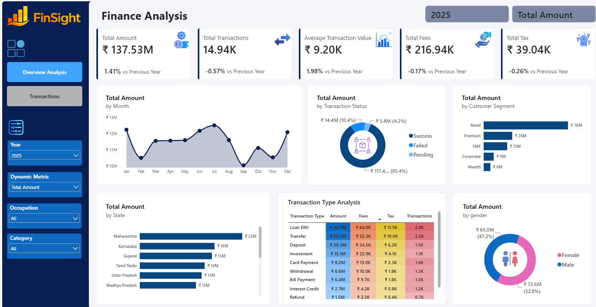
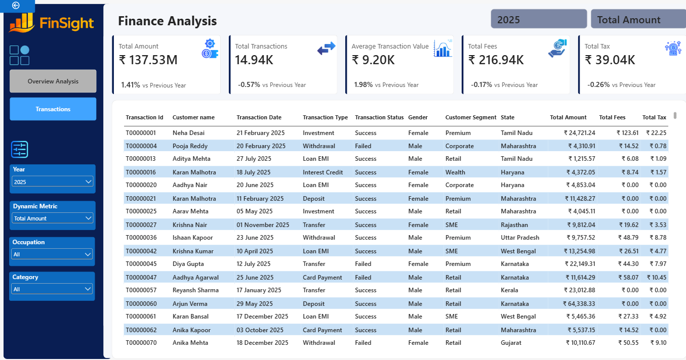

# Finsight Finance Transaction Analysis

## 📊 Project Overview

**Finsight Finance Transaction Analysis** is an interactive Power BI dashboard designed to analyze financial transactions, customer behavior, transaction performance, fees, taxes, customer segments, and regional performance.

The dashboard provides management with a centralized view of financial KPIs and allows users to explore transaction-level records through interactive filters and a detailed transaction view.

## 🎯 Business Objective

The objective of this project is to help stakeholders:

- Monitor overall transaction growth and financial performance
- Analyze monthly transaction trends
- Compare successful, failed, and pending transactions
- Identify high-performing customer segments and states
- Analyze transaction type performance
- Track operational fees and taxes
- Understand customer demographics
- Compare Year-over-Year (YoY) performance
- Drill down into underlying transaction records

## 🛠️ Tools & Technologies

- **Power BI Desktop**
- **DAX**
- **Power Query**
- **Data Modeling**
- **CSV**

## 📌 Key KPIs

The dashboard includes the following primary KPIs:

- **Total Amount**
- **Total Transactions**
- **Average Transaction Value**
- **Total Fees**
- **Total Tax**
- **YoY Growth**

### Example Dashboard Snapshot — 2025

The dashboard currently displays:

| KPI | Value | YoY Change |
|---|---:|---:|
| Total Amount | ₹137.53M | +1.41% |
| Total Transactions | 14.94K | -0.57% |
| Average Transaction Value | ₹9.20K | +1.98% |
| Total Fees | ₹216.94K | -0.17% |
| Total Tax | ₹39.04K | -0.26% |

> The KPI values above reflect the dashboard view shown for **2025** with the displayed filters.

## 📈 Dashboard Features

### 1. Transaction Trend Analysis

The dashboard is designed to analyze:

- Monthly transaction amount trends
- Seasonal increases and decreases
- Year-over-Year performance

### 2. Transaction Status Analysis

Transaction amounts can be analyzed by:

- Success
- Failed
- Pending

This helps evaluate transaction performance and operational efficiency.

### 3. Customer Segment Analysis

The dashboard supports analysis across customer segments such as:

- Retail
- Premium
- SME
- Corporate
- Wealth

### 4. Regional Analysis

State-wise transaction performance can be compared to identify high-performing regions.

### 5. Transaction Type Analysis

The project analyzes transaction performance across transaction types including:

- Bill Payment
- Card Payment
- Deposit
- Fee Charge
- Interest Credit
- Investment
- Loan EMI
- Refund
- Transfer
- Withdrawal

Metrics include:

- Amount
- Fees
- Tax
- Transaction Count

### 6. Customer Demographic Analysis

Transaction contribution can be analyzed by gender:

- Male
- Female

### 7. Interactive Filters

The dashboard includes dynamic filtering for:

- Year
- Dynamic Metric
- Occupation
- Category

### 8. Transaction-Level Detail

A detailed grid view provides underlying transaction records, including fields such as:

- Transaction ID
- Customer Name
- Transaction Date
- Transaction Type
- Transaction Status
- Gender
- Customer Segment
- State
- Total Amount
- Total Fees
- Total Tax

## 🖼️ Dashboard Preview

### Overview Analysis



### Transaction Details



## 📂 Project Structure

```text
Finsight-Finance-Transaction-Analysis/
│
├── PowerBI/
│   └── Finsight Transaction Analysis.pbix
│
├── Data/
│   ├── customers.csv
│   └── finance_transactions.csv
│
├── Documentation/
│   └── Business Requirements.docx
│
├── Screenshots/
│   ├── Overview.png
│   └── Transaction.png
│
└── README.md
```

## 🔍 Business Questions Addressed

This dashboard is designed to answer questions such as:

- How much transaction value is being processed?
- How many transactions are being performed?
- How is transaction value changing compared with the previous year?
- Which transaction statuses contribute the most amount?
- Which customer segments contribute the most transaction value?
- Which states generate the highest transaction amounts?
- Which transaction types generate the highest amount, fees, and tax?
- How does transaction activity differ by gender?
- What are the underlying transaction-level records?

## 💡 Key Dashboard Observations

From the displayed 2025 dashboard view:

- Total transaction amount is **₹137.53M**.
- Total transaction volume is **14.94K transactions**.
- Average transaction value is **₹9.20K**.
- Total fees are **₹216.94K**.
- Total tax is **₹39.04K**.
- Total amount shows **1.41% YoY growth**.
- Transaction count shows a **0.57% YoY decline**.
- Average transaction value shows **1.98% YoY growth**.

These observations are based on the currently displayed dashboard view and may change when filters are modified.

## 🚀 How to Use

1. Download the Power BI `.pbix` file from the `PowerBI` folder.
2. Open it using **Power BI Desktop**.
3. If a data refresh is required, ensure the CSV files are available in the expected location.
4. Use the dashboard filters to change the analysis by year, metric, occupation, and category.
5. Explore the transaction detail view for underlying records.

## 📚 Documentation

The `Documentation` folder contains the original business requirements for the dashboard.

## 👤 Author

**Rabi Ali**

Data Analyst | Power BI | SQL | Python

---

⭐ If you found this project useful, consider starring the repository.
